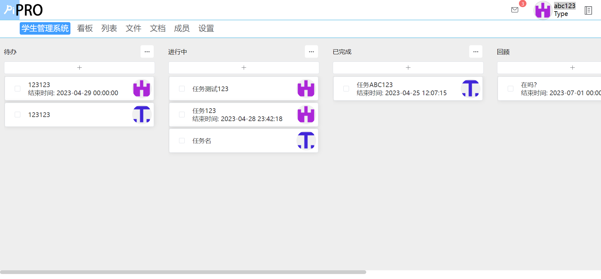
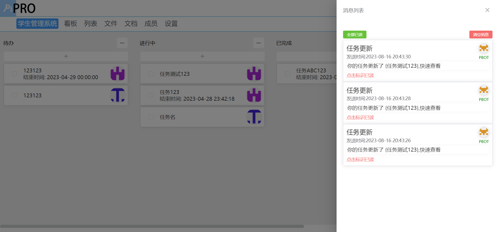

# PiPROServer - 后端源码

技术栈: Springboot + Mybatis-PLUS
数据库: Mysql、Redis

自研鉴权技术、自研AOP自动缓存技术

PiPRO是一款适用于50人小团队的多人协同敏捷开发工具。独立部署于使用者服务器上，数据全部掌握在用户手中。包含 看板、列表、在线文件、在线文档、用户权限管理等多项敏捷开发功能。无冗余功能，方便小团队进行协同开发。

基于AOP技术自研缓存方案，让请求优化到100ms以内。PiPRO拥有非常好的性能，即使是云端，也可以把请求控制在100ms以内。这得益于使用AOP技术自主研发的缓存技术。将异步数据进行同步展示。

消息系统使用线程池发送邮箱提醒。

待办：

- [ ] 后台管理面板
- [ ] 全局更新接口

项目详情界面

消息列表界面
